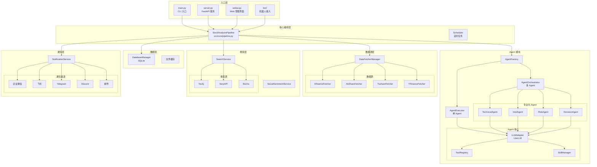
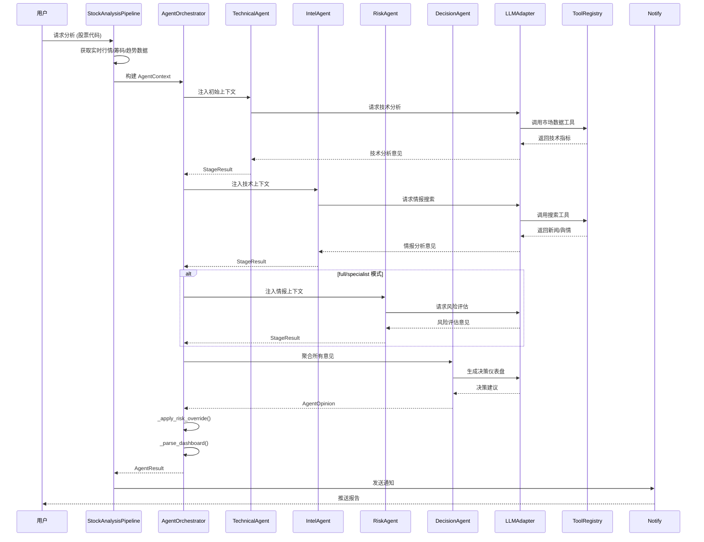
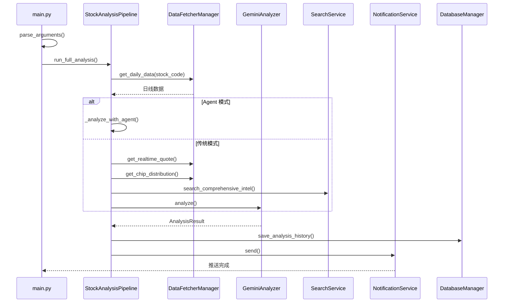

# 系统架构文档

## 概述

股票智能分析系统是一个基于 AI 大模型的 A股/港股/美股自选股智能分析系统，每日自动分析并推送「决策仪表盘」到企业微信/飞书/Telegram/Discord/Slack/邮箱等渠道。

系统支持两种分析模式：
1. **传统模式**：数据获取 → 技术分析 → AI 决策生成
2. **Agent 模式**：基于多 Agent 协作的智能分析，支持单 Agent 和多 Agent 架构

系统通过多数据源故障切换策略确保数据获取的可靠性，支持 Tushare、AkShare、YFinance 等多个数据源。AI 分析基于 LiteLLM 统一接口，支持 Gemini、GPT、Claude、DeepSeek 等多种模型。

## 技术栈

**语言与运行时**
- Python 3.10+

**框架**
- FastAPI - Web API 服务
- SQLAlchemy - ORM 数据访问
- LiteLLM - LLM 统一接口
- Jinja2 - 报告模板渲染

**数据存储**
- SQLite - 本地数据库（历史分析、持仓、配置）
- 文件系统 - 缓存和临时文件

**基础设施**
- GitHub Actions - CI/CD 与定时任务
- Docker - 容器化部署

**外部服务**
- AI 模型：AIHubMix、Gemini、OpenAI、DeepSeek、Claude、Ollama
- 行情数据：AkShare、Tushare、YFinance、Baostock、Pytdx
- 新闻搜索：Tavily、SerpAPI、Bocha、Brave Search
- 社交舆情：Stock Sentiment API（Reddit/X/Polymarket）

## 项目结构

```
/workspace/
├── main.py                 # CLI 主入口
├── server.py               # FastAPI 服务入口
├── webui.py                # Web 管理界面入口
├── src/
│   ├── core/               # 核心流程编排
│   │   ├── pipeline.py     # 股票分析流水线 (StockAnalysisPipeline)
│   │   ├── market_review.py # 大盘复盘
│   │   └── trading_calendar.py # 交易日历
│   ├── agent/              # AI Agent 模块
│   │   ├── executor.py      # 单 Agent 执行器
│   │   ├── orchestrator.py  # 多 Agent 编排器
│   │   ├── factory.py       # Agent 工厂
│   │   ├── llm_adapter.py   # LiteLLM 适配器
│   │   ├── runner.py        # 共享执行循环
│   │   ├── protocols.py     # 共享数据结构
│   │   ├── agents/          # 专业化 Agent
│   │   ├── skills/          # 技能系统
│   │   ├── strategies/      # 策略系统
│   │   └── tools/           # 工具注册表
│   ├── services/            # 业务服务层
│   ├── repositories/        # 数据访问层
│   ├── notification_sender/ # 通知渠道发送器
│   ├── schemas/             # 数据 Schema
│   ├── config.py           # 配置管理（单例模式）
│   ├── storage.py           # 数据库层（SQLAlchemy）
│   ├── analyzer.py          # AI 分析器
│   ├── stock_analyzer.py    # 技术分析器
│   ├── search_service.py    # 搜索服务
│   ├── notification.py      # 通知服务
│   └── scheduler.py         # 定时任务
├── data_provider/           # 数据源适配层
│   ├── base.py             # 数据源管理器
│   ├── akshare_fetcher.py  # AkShare 数据源
│   ├── tushare_fetcher.py  # Tushare 数据源
│   ├── yfinance_fetcher.py  # YFinance 数据源
│   └── ...
├── api/                    # FastAPI 接口
│   └── v1/                  # API v1 版本
├── bot/                    # 机器人接入
│   ├── commands/           # 命令处理器
│   └── platforms/          # 平台适配器
├── apps/
│   ├── dsa-web/           # Web 前端
│   └── dsa-desktop/       # Electron 桌面端
├── tests/                  # 测试
├── scripts/               # 脚本
├── templates/              # 报告模板
└── docs/                   # 文档
```

**入口点**
- `main.py` - CLI 主入口，支持定时任务、单次分析、大盘复盘等模式
- `server.py` - FastAPI 服务入口，提供 REST API
- `webui.py` - Web 管理界面入口

## 子系统

### StockAnalysisPipeline
**目的**: 管理整个股票分析流程，协调各模块完成数据获取、AI 分析、通知推送

**位置**: `src/core/pipeline.py`

**关键方法**:
- `run()` - 运行完整分析流程，线程池并发处理多只股票
- `process_single_stock()` - 处理单只股票的完整流程
- `analyze_stock()` - 执行单只股票 AI 分析
- `_analyze_with_agent()` - Agent 模式分析

**依赖**: DataFetcherManager、StockAnalyzer、NotificationService、SearchService、DatabaseManager

**被依赖**: main.py、API endpoints

### Agent 模块
**目的**: 提供基于 AI Agent 的智能分析能力，支持单 Agent 和多 Agent 协作

**位置**: `src/agent/`

**关键组件**:
- `executor.py` - 单 Agent 执行器（ReAct 循环）
- `orchestrator.py` - 多 Agent 编排器
- `factory.py` - Agent 工厂
- `agents/` - 专业化 Agent（TechnicalAgent、IntelAgent、RiskAgent、DecisionAgent）

**依赖**: LiteLLM、ToolRegistry、SkillManager

**被依赖**: StockAnalysisPipeline

### DataFetcherManager
**目的**: 多数据源管理，实现故障自动切换

**位置**: `data_provider/base.py`

**关键方法**:
- `get_daily_data()` - 获取日线数据
- `get_realtime_quote()` - 获取实时行情
- `get_chip_distribution()` - 获取筹码分布

**数据源优先级**: Efinance → AkShare → Tushare → Pytdx → Baostock → YFinance

**依赖**: 各数据源 Fetcher

**被依赖**: StockAnalysisPipeline、Agent Tools

### NotificationService
**目的**: 聚合多渠道通知，统一发送分析报告

**位置**: `src/notification_sender/`

**支持的渠道**: 企业微信、飞书、Telegram、Discord、Slack、钉钉、邮件、PushPlus、Server酱

**依赖**: 各渠道 Sender

**被依赖**: StockAnalysisPipeline

### SearchService
**目的**: 多维度情报搜索，整合新闻、社交舆情

**位置**: `src/search_service.py`

**支持的搜索源**: Tavily、SerpAPI、Bocha、Brave Search、SearXNG

**依赖**: 外部搜索 API

**被依赖**: StockAnalysisPipeline、Agent Tools

### DatabaseManager
**目的**: 统一数据库操作，管理分析历史、持仓、配置

**位置**: `src/storage.py`

**关键表**: analysis_history、backtest_results、portfolio、system_config

**依赖**: SQLAlchemy、SQLite

**被依赖**: 所有需要持久化的模块

## 系统架构图



## Agent 协作流程图



## 分析流水线时序图


